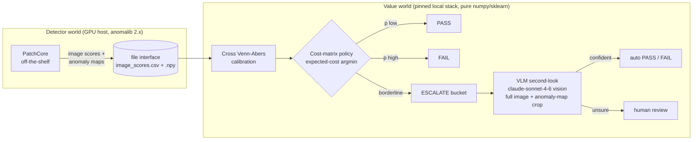

# AIQS-Agent

**An agentic adjudication layer for industrial visual quality inspection** — cost-aware,
calibrated, *abstaining* decisions layered on top of an off-the-shelf anomaly detector,
with a VLM second-look on exactly the items the policy cannot decide.

> **Thesis.** In industrial visual inspection the detector is a commodity; the value is in
> the **decision layer**. We optimize a business cost function and the false-reject
> (overkill) rate — not detection AUROC — and we measure every claim against a tuned
> no-layer baseline, with pre-registered criteria and honest nulls.

📄 Deep dives: [Architecture](docs/ARCHITECTURE.md) ·
[Experiment log & evidence](docs/EXPERIMENTS.md) ·
[Phase-0 report](docs/PHASE0_REPORT.md) ·
[Project memory / decision log](CLAUDE.md)

---

## How it works



The two worlds talk **by file, not by import**: the detector runs on a GPU host
(anomalib 2.x), the decision layer runs anywhere (no torch). A version-dispatched seam
keeps one codebase working against both stacks.

## Status at a glance

| Phase | What | Status |
|---|---|---|
| 0 | Detection baseline + eval backbone (PatchCore, image/pixel metrics) | ✅ complete |
| 1 | Calibrated, cost-aware, abstaining decision layer + operating envelope | ✅ complete — **first real win on VisA candle: 11–13% cheaper than a tuned threshold** |
| 2A | VLM second-look backbone (ESCALATE-only, pre-registered independence test) | ✅ complete (mock-tested, live model-ID verified) |
| 2B | Hard-substrate hunt + **two-arm full-vs-crop experiment** | 🟡 in progress — substrate found (VisA), instrument validated, **haiku rehearsal done**, sonnet headline run pending |

## Key findings so far

- **Operating envelope (Phase 1).** Cost-aware abstention beats a tuned threshold when
  review is cheap, the detector is genuinely uncertain, or escapes are cost-dominant —
  and the layer *tells you which regime you are in*. On a saturated detector it honestly
  reports that a threshold suffices; on VisA `candle` it delivered a real 11%/13% cost win.
- **Substrate matters and must be measured.** Standard MVTec saturates (~0.97 image-AUROC
  → empty ESCALATE bucket). The VisA sweep found three powered grounds
  (`capsules` 0.739, `macaroni1` 0.815, `macaroni2` 0.646).
- **Haiku rehearsal (first real two-arm data, $1.77).** A cheap-tier VLM second-look is a
  **rubber stamp**: "clean" on 545/545 full-image calls; the anomaly-map crop fixes only
  2% of escapes while **94% classify as SEMANTIC** under pre-registered rules — the model
  *sees* the flagged region and calls it normal. Escapes are 100% stable-wrong and
  self-reported confidence carries no signal (AUC 0.50). Rehearsal-grade evidence; the
  locked-model (claude-sonnet-4-6) headline run is next.

## Quickstart

```bash
make install                 # uv sync (pinned local stack)
make smoke                   # fast end-to-end sanity run
make baseline CATEGORY=screw # train + eval, writes results/
make decide                  # Phase-1 adjudication on the latest run
make vlm RUN=<id> MOCK=1     # Phase-2A VLM second-look (mock = no API)
make vlm-crop RUN=<id>       # Phase-2B two-arm full-vs-crop experiment
make sim                     # SYNTHETIC machinery validation (walled off)
make test                    # 83 unit tests (all API calls mocked)
```

GPU detector rounds (anomalib 2.x, VisA/MVTec-AD2) run on a CUDA host:
see [`requirements-ad2.txt`](requirements-ad2.txt) and
[`scripts/run_ad2_gpu.py`](scripts/run_ad2_gpu.py) (`--smoke`, `--sweep`, single-round).

## Integrity by construction

The credibility of a null result is this project's core asset. Enforced in code, not policy:

- **Pre-registered criteria** — the error-independence rule (Wilson-lo > 0.50) and the
  escape-classification rules (PERCEPTION/SEMANTIC regex family) were frozen and committed
  *before* the data existed; an UNCLASSIFIED ceiling declares the labeling itself
  inadequate rather than widening rules post hoc.
- **Substrate guard** — refuses to spend API budget on a bucket too small to measure.
- **Served-model stop** — every API call verifies the served model; a silent downgrade
  aborts the run.
- **Walled-off mocks & synthetic data** — `mock_*` artifacts are gitignored and can never
  touch real evidence files.
- **Checkpoint/resume** — every paid API call is flushed to disk; a crash loses at most
  one call and a re-run never re-bills.
- **Honest nulls in the log** — the weak-detector null, the saturated-substrate finding,
  and the voided first dry-run are all committed, with root causes.

## Repository layout

```
configs/          YAML configs (dataset/category/model/crop — all CLI-overridable)
src/aiqs/
  detector.py     version-dispatched detector seam (anomalib 1.2 local / 2.x GPU)
  data.py         datamodules: MVTec (1.2) · MVTecAD/AD2/VisA (2.x)
  crop.py         anomaly-map peak → high-res crop instrument (diffuse-aware)
  decide.py       Phase-1 calibration + cost policy + operating-envelope report
  vlm/            Phase-2 VLM second-look (backend, abstain rule, pre-registered rules)
  vlm_crop.py     Phase-2B two-arm experiment runner (checkpoint/resume)
  eval/           metrics, persistence, decision + VLM + two-arm evaluation
scripts/          GPU runner (run_ad2_gpu.py) · local diagnostics (verify_vlm_local.py)
results/          committed evidence: metrics.csv, decisions.csv, per-run summaries + plots
tests/            83 tests — decision policy, calibration, crop, two-arm, guards (API mocked)
docs/             architecture & experiment documentation
```

## Stack

Local (pinned, Intel-mac CPU): `anomalib 1.2 · torch 2.2.2 · numpy<2` — the decision/VLM
layer itself is pure numpy/sklearn + the Anthropic API. GPU host: `anomalib 2.x` via a
separate requirements file (the two stacks are mutually exclusive by dependency —
measured, documented in [CLAUDE.md](CLAUDE.md)).
