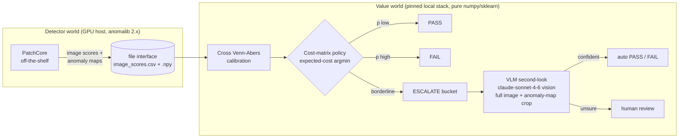
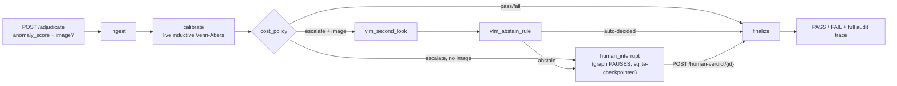

# AIQS-Agent

**An agentic adjudication layer for industrial visual quality inspection** — cost-aware,
calibrated, *abstaining* decisions layered on top of an off-the-shelf anomaly detector,
with a VLM second-look on exactly the items the policy cannot decide.

> **Thesis.** In industrial visual inspection the detector is a commodity; the value is in
> the **decision layer**. We optimize a business cost function and the false-reject
> (overkill) rate — not detection AUROC — and we measure every claim against a tuned
> no-layer baseline, with pre-registered criteria and honest nulls.

📄 Deep dives: [Architecture](docs/ARCHITECTURE.md) ·
[Experiment log & evidence](docs/EXPERIMENTS.md) ·
[Phase-0 report](docs/PHASE0_REPORT.md) ·
[Project memory / decision log](CLAUDE.md)

---

## The story, end to end

1. **Honest null.** The first real detector (600-step EfficientAD, image-AUROC 0.559) had
   no exploitable signal. The decision layer's own guard refused to manufacture a
   false-positive headline from it — that refusal, not a number, was the first result.
2. **Hardware diagnosis.** This runs on a 2-core, CUDA-free, MPS-free Intel Mac. That
   constraint pinned the detector stack to anomalib 1.2/torch 2.2.2 (the last x86_64-macOS
   wheel) and pushed real training to Colab/Kaggle GPU — while keeping the decision layer
   itself pure numpy/sklearn, so it runs anywhere the detector doesn't need to.
3. **Substrate hunt.** A strong detector (PatchCore, image-AUROC 0.976) saturates standard
   MVTec — no borderline items left to adjudicate. Measured, not assumed: a VisA sweep
   found three genuinely hard categories (`capsules`, `macaroni1`, `macaroni2`) with real
   ESCALATE-bucket substrate.
4. **Tier-sensitive mechanism.** The VLM second-look is not one story: Haiku is a rubber
   stamp (545/545 "clean"), while Sonnet's anomaly-map crop cuts escape 0.500→0.115 with
   powered, non-degenerate independence — identical bucket and prompt, different model
   tier, opposite conclusion. The mechanism is measured per tier, never assumed to transfer.
5. **Regime-conditional verdict.** Neither the decision layer nor the VLM crop wins
   universally — each reports the operating envelope it actually measured (cheap review /
   weak detector / escape-dominant costs favor the layer; a strong detector with expensive
   review favors a tuned threshold). The API productizes this directly: every decision
   states the regime that produced it.
6. **Torch-free serving.** Phase 3 turns the proven pipeline into a LangGraph + FastAPI
   service that reads a completed run directory as its only input — no detector, no torch,
   auditable by construction, live-demoed end to end (see [Serving](#serving-phase-3)).

## How it works



The two worlds talk **by file, not by import**: the detector runs on a GPU host
(anomalib 2.x), the decision layer runs anywhere (no torch). A version-dispatched seam
keeps one codebase working against both stacks. Phase 3 extends the file interface to
**serve time**: a completed run directory *is* the "decision artifact" a FastAPI server
loads (see [Serving](#serving-phase-3) below) — no separate model-export step.

## Status at a glance

| Phase | What | Status |
|---|---|---|
| 0 | Detection baseline + eval backbone (PatchCore, image/pixel metrics) | ✅ complete |
| 1 | Calibrated, cost-aware, abstaining decision layer + operating envelope | ✅ complete — **first real win on VisA candle: 11–13% cheaper than a tuned threshold** |
| 2A | VLM second-look backbone (ESCALATE-only, pre-registered independence test) | ✅ complete (mock-tested, live model-ID verified) |
| 2B | Hard-substrate hunt + **two-arm full-vs-crop experiment** | ✅ **headline obtained** (sonnet-4-6, capsules, $6.60): crop cuts escape **0.500→0.115** with powered, non-degenerate independence — a real, tier-sensitive win (Haiku Δ0.038 vs Sonnet Δ0.385), with two honest caveats (overkill trade + 45%-unclassified labeling) |
| 3 | Productization: **LangGraph orchestration + FastAPI Intelligent API** | ✅ complete — auditable, regime-conditional, torch-free serving over the proven pipeline |

## Key findings so far

- **Operating envelope (Phase 1).** Cost-aware abstention beats a tuned threshold when
  review is cheap, the detector is genuinely uncertain, or escapes are cost-dominant —
  and the layer *tells you which regime you are in*. On a saturated detector it honestly
  reports that a threshold suffices; on VisA `candle` it delivered a real 11%/13% cost win.
- **Substrate matters and must be measured.** Standard MVTec saturates (~0.97 image-AUROC
  → empty ESCALATE bucket). The VisA sweep found three powered grounds
  (`capsules` 0.739, `macaroni1` 0.815, `macaroni2` 0.646).
- **Haiku rehearsal (first real two-arm data, $1.77).** A cheap-tier VLM second-look is a
  **rubber stamp**: "clean" on 545/545 full-image calls; the anomaly-map crop fixes only
  2% of escapes while **94% classify as SEMANTIC** under pre-registered rules — the model
  *sees* the flagged region and calls it normal. Escapes are 100% stable-wrong and
  self-reported confidence carries no signal (AUC 0.50). Rehearsal-grade evidence, not the
  headline — it exposed a real gap (a rubber-stamp run can pass the independence test by
  luck), closed by a **degeneracy guard** added to the shared eval code *before* the
  headline run (pre-registered, applies to every model tier).
- **The model-tier lever (ARM-C).** A provider-agnostic backend (any OpenAI-compatible
  endpoint — Google AI Studio, OpenRouter, ...) reuses the identical bucket/crop/checkpoint
  machinery to sweep cost from $0 to frontier; swapping a free-tier roster entry is a
  config change, never a code change (`aiqs-model-tier-report` for the cross-tier table).
  Engineering complete; no real run executed yet.
- **Headline (claude-sonnet-4-6, capsules, $6.60).** The crop cuts Sonnet's escape rate
  **0.500 → 0.115** (77%), with **powered, non-degenerate** independence (n_dw=54, both
  arms) — real signal, not the cheap-tier artifact. The second-look is **tier-sensitive**:
  identical bucket/crop/rules, escape Δ goes 0.038 (Haiku) → 0.385 (Sonnet). Two honest
  caveats, both from pre-registered criteria: the crop **trades overkill-reduction for
  escape-reduction** (good-rescue 54→30 as it catches more defects), and the
  perception-vs-semantic split is **PERCEPTION-leaning (48 vs 24) but 45% unclassified >
  the 0.30 ceiling → human read required**. Full write-up:
  [docs/EXPERIMENTS.md §9](docs/EXPERIMENTS.md).

## Quickstart

```bash
make install                 # uv sync (pinned local stack)
make smoke                   # fast end-to-end sanity run
make baseline CATEGORY=screw # train + eval, writes results/
make decide                  # Phase-1 adjudication on the latest run
make vlm RUN=<id> MOCK=1     # Phase-2A VLM second-look (mock = no API)
make vlm-crop RUN=<id>       # Phase-2B two-arm full-vs-crop experiment (Anthropic, locked)
make model-tier-report RUN=<id>  # cross-tier comparison table (Haiku/Sonnet/ARM-C)
make sim                     # SYNTHETIC machinery validation (walled off)
make serve RUN=<id>          # Phase-3 FastAPI Intelligent API (mock VLM, no key needed)
make test                    # unit tests (all API calls mocked)
```

ARM-C (a free-tier model-tier run) is `aiqs-vlm-crop` with `--provider openai_compatible
--model <m> --base-url <u> --api-key-env <e>` — see
[`configs/free_vlm_roster.example.yaml`](configs/free_vlm_roster.example.yaml).

GPU detector rounds (anomalib 2.x, VisA/MVTec-AD2) run on a CUDA host:
see [`requirements-ad2.txt`](requirements-ad2.txt) and
[`scripts/run_ad2_gpu.py`](scripts/run_ad2_gpu.py) (`--smoke`, `--sweep`, single-round).

## Serving (Phase 3)

The proven pipeline (calibration → cost policy → VLM second-look → human review) is
productized as a **LangGraph orchestration** behind a **FastAPI Intelligent API** — both
consuming the SAME completed `results/runs/<id>/` directory as a "decision artifact",
no separate export step, no torch/anomalib in the serving path.



```bash
uv run aiqs-serve --run <id>                       # mock VLM, no API key — try it now
uv run aiqs-serve --run <id> --provider anthropic --image-root datasets/
bash scripts/demo_requests.sh                       # clean PASS · escalation+VLM · human resume
```

- **Torch-free by construction.** `aiqs.api`/`aiqs.graph` never import anomalib/torch;
  they read the run's `image_scores.csv` exactly like `aiqs-decide` does.
- **Calibration is live, not cached.** A new score is scored by inductive Venn-Abers
  against the run's own labelled set (`aiqs.eval.decision.ivap`) — this is what an
  inference-time Venn-Abers prediction *is*, not an approximation of one. It will not
  bit-match the run's committed cross/OOF `decision_scores.csv` (a different, also-valid
  estimator) — see CLAUDE.md.
- **Every decision is auditable by construction.** LangGraph's own checkpointed state
  history (`get_state_history`) *is* the audit trace — nothing hand-rolled to drift.
- **Regime-conditional, not one-size-fits-all.** Cost matrix and target prevalence are
  per-request overridable; the response always states which regime produced the decision
  (Phase 1's operating-envelope finding, exposed as an API feature).
- **Auth** is a single env-var API key (`AIQS_API_KEY` by default); unset ⇒ disabled with
  a loud startup warning (dev mode only — see the docs caveat before exposing this
  beyond localhost).

## Integrity by construction

The credibility of a null result is this project's core asset. Enforced in code, not policy:

- **Pre-registered criteria** — the error-independence rule (Wilson-lo > 0.50) and the
  escape-classification rules (PERCEPTION/SEMANTIC regex family) were frozen and committed
  *before* the data existed; an UNCLASSIFIED ceiling declares the labeling itself
  inadequate rather than widening rules post hoc.
- **Substrate guard** — refuses to spend API budget on a bucket too small to measure.
- **Served-model stop** — every API call verifies the served model; a silent downgrade
  aborts the run.
- **Walled-off mocks & synthetic data** — `mock_*` artifacts are gitignored and can never
  touch real evidence files.
- **Checkpoint/resume** — every paid API call is flushed to disk; a crash loses at most
  one call and a re-run never re-bills. Namespaced by (provider, model) so a rehearsal or
  a free-tier ARM-C run can never contaminate the locked headline run.
- **Degeneracy guard** — a rubber-stamp verdict distribution (≥95% one answer) is forced
  to an explicit `invalid-degenerate` label, never counted as a spurious "independent".
- **Honest nulls in the log** — the weak-detector null, the saturated-substrate finding,
  and the voided first dry-run are all committed, with root causes.
- **item_id collision guard (Phase 3)** — re-posting an in-flight or finalized item_id to
  `/adjudicate` returns `409`, never a silent overwrite or a stale-looking success.
- **Path-traversal guard (Phase 3)** — `image_path` requests are confined to a configured
  `--image-root` (rejected otherwise); `image_b64` is the safe default with no filesystem
  exposure at all.
- **Node-composition parity guard (Phase 3)** — the graph's `vlm_second_look`/
  `vlm_abstain_rule` split is tested byte-for-byte against the single-pass
  `aiqs.vlm.adjudicate.adjudicate()` it decomposes, so the two can never silently drift.

## Repository layout

```
configs/          YAML configs (dataset/category/model/crop — all CLI-overridable)
src/aiqs/
  detector.py     version-dispatched detector seam (anomalib 1.2 local / 2.x GPU)
  data.py         datamodules: MVTec (1.2) · MVTecAD/AD2/VisA (2.x)
  crop.py         anomaly-map peak → high-res crop instrument (diffuse-aware)
  decide.py       Phase-1 calibration + cost policy + operating-envelope report
  vlm/            Phase-2 VLM second-look — backend.py (Anthropic, locked headline),
                  backend_openai_compatible.py (ARM-C, any OpenAI-compatible provider),
                  image_encode.py / model_guard.py (shared, fork-prevention), abstain
                  rule, reasoning_rules.py (pre-registered escape classification)
  vlm_crop.py     Phase-2B two-arm experiment runner (checkpoint/resume, --smoke)
  model_tier_report.py  cross-tier comparison (Haiku/Sonnet/ARM-C), walled off from summary.md
  eval/           metrics, persistence, decision + VLM (incl. the degeneracy guard) +
                  two-arm evaluation
  api/            Phase-3 decision artifact (live inductive Venn-Abers) + FastAPI app
                  (aiqs-serve)
  graph/          Phase-3 LangGraph orchestration — state, nodes, build_graph(), the
                  aiqs-graph demo/debug CLI (shared with aiqs-serve, one graph two front doors)
scripts/          GPU runner (run_ad2_gpu.py) · local diagnostics (verify_vlm_local.py) ·
                  demo_requests.sh (the Phase-3 clean-PASS / escalation / human-resume demo)
results/          committed evidence: metrics.csv, decisions.csv, per-run summaries + plots
tests/            decision policy, calibration, crop, two-arm, guards, ARM-C backend,
                  model-tier report, graph paths, API contract, graph/API parity guards,
                  a real-run serving integration test (API mocked throughout)
docs/             architecture & experiment documentation
```

## Stack

Local (pinned, Intel-mac CPU): `anomalib 1.2 · torch 2.2.2 · numpy<2` — the decision/VLM
layer itself is pure numpy/sklearn + the Anthropic API. GPU host: `anomalib 2.x` via a
separate requirements file (the two stacks are mutually exclusive by dependency —
measured, documented in [CLAUDE.md](CLAUDE.md)). Serving (Phase 3) adds
`langgraph · langgraph-checkpoint-sqlite · fastapi · uvicorn` — independent of the
detector pin, torch-free, installs on the same local stack.
