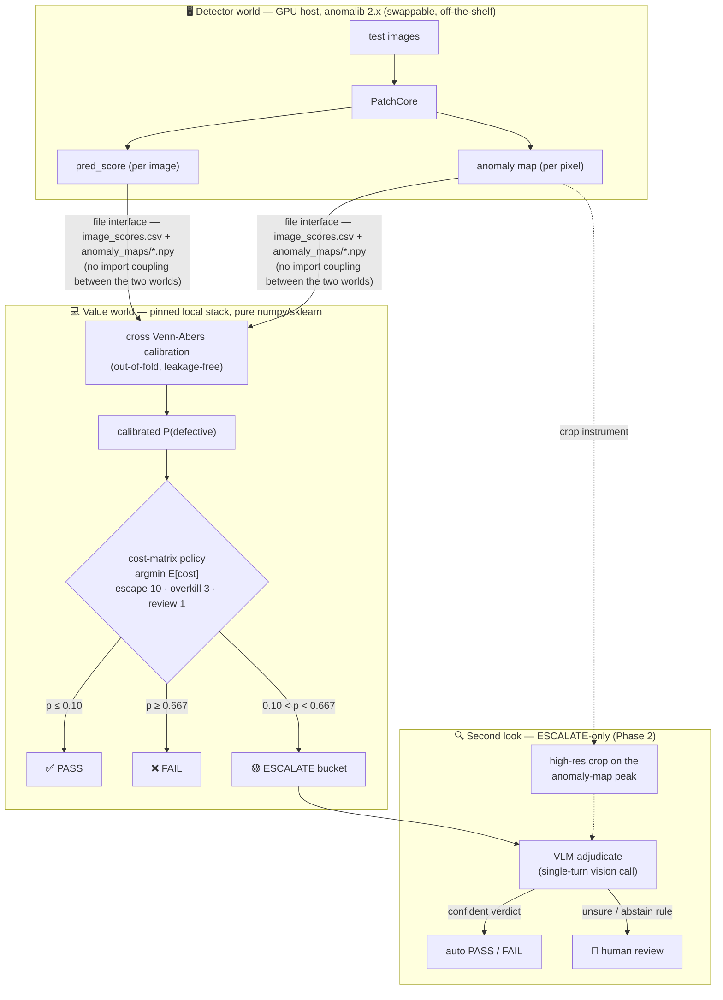
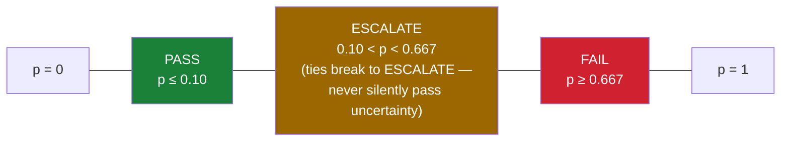
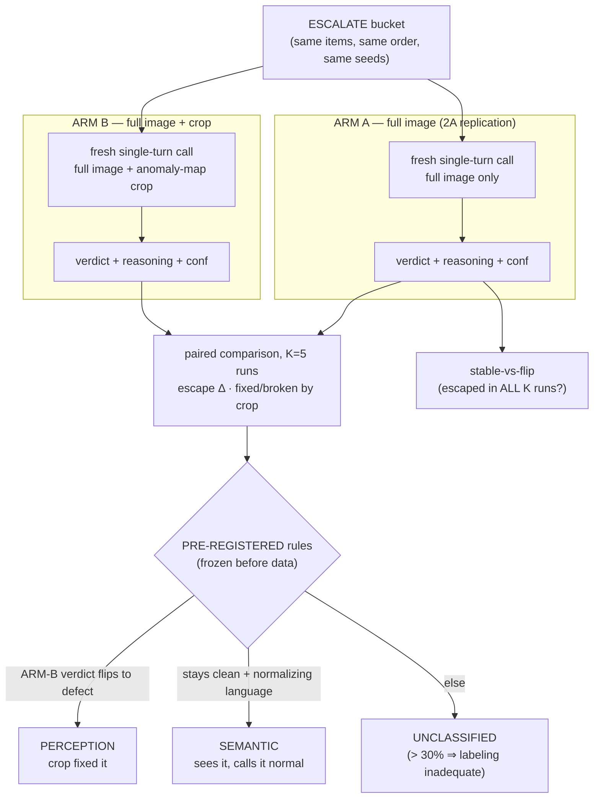

# Architecture

AIQS-Agent is a **decision + reasoning layer on top of a commodity anomaly detector**.
This document shows how the pieces fit, visually. The durable rationale for every design
decision lives in [CLAUDE.md](../CLAUDE.md) (decision log).

## 1. System overview

**Why the file interface matters:** the detector needs a GPU and anomalib 2.x; the value
layer needs neither. They are *mutually exclusive dependency worlds* (measured — the
pinned local caps cannot co-resolve with anomalib ≥ 2.2), so they communicate only
through committed CSV/NPY artifacts. A version-dispatched seam
(`detector.py` / `data.py` → `_detector_v2.py` / `_data_v2.py`) lets one codebase drive
both stacks.

## 2. The decision policy

The cost matrix is **locked** (escape 10 · overkill 3 · review 1; realistic variant
100/3/1). Expected-cost argmin over the calibrated probability produces three bands:

The headline metric is the **risk–coverage trade-off against a cost-optimal tuned
threshold** (the honest no-layer baseline), swept over review cost — reported per run in
`results/runs/<id>/risk_coverage*.png` and `breakeven.csv`.

## 3. The two-arm full-vs-crop experiment (Phase 2B, Stage 3)

Hypothesis under test: *escapes are perception failures — a high-res crop on the
detector-flagged region reduces them.*

Arm independence is enforced in code: every call is a fresh single-turn API request (no
shared conversation → no anchoring), each arm has its own state objects, and a diffuse
anomaly map (no focal peak) yields a byte-identical ARM-A call — excluded from
classification. Every paid call is **checkpointed to disk on return**; re-running resumes
without re-billing.

## 4. Guards (enforced in code, not convention)

| Guard | Where | Effect |
|---|---|---|
| Substrate guard | `vlm/substrate.py` | ESCALATE∩good < 15 → refuse to run; < 30 → underpowered warning |
| Served-model stop | `vlm/model_guard.py` (shared by both backends) | any call served ≠ requested model → abort (silent-downgrade lesson) |
| Degeneracy guard | `eval/vlm_eval.py` | one verdict ≥95% of a run → `invalid-degenerate`, never a spurious "independent" |
| Honesty guard | `eval/decision.py` | signal-free scores → refuse a false-positive headline |
| Mock wall | `.gitignore` + naming | `mock_*` artifacts can never enter evidence files |
| Checkpoint integrity | `vlm_crop.py` | refuses resume across a different bucket, model, **or provider** |
| Pre-registered rules | `vlm/reasoning_rules.py` | frozen classification; UNCLASSIFIED ceiling instead of post-hoc widening |

## 5. ARM-C — the model-tier lever

`vlm/backend_openai_compatible.py` implements the SAME call contract
(`backend(state) -> VLMVerdict`) behind any OpenAI-Chat-Completions-compatible endpoint,
so the two-arm experiment (§3) and all its guards (§4) run unchanged against a $0 free
tier through the frontier headline model. `base_url` / `model` / `api_key_env` are
caller-supplied — a roster swap is a config change, not a code change. Rate limiting is
two independent mechanisms: a proactive `rpm_limit` pace (before hitting a free tier's
ceiling) and the SDK's own retry/backoff (after a transient error) — see CLAUDE.md.
