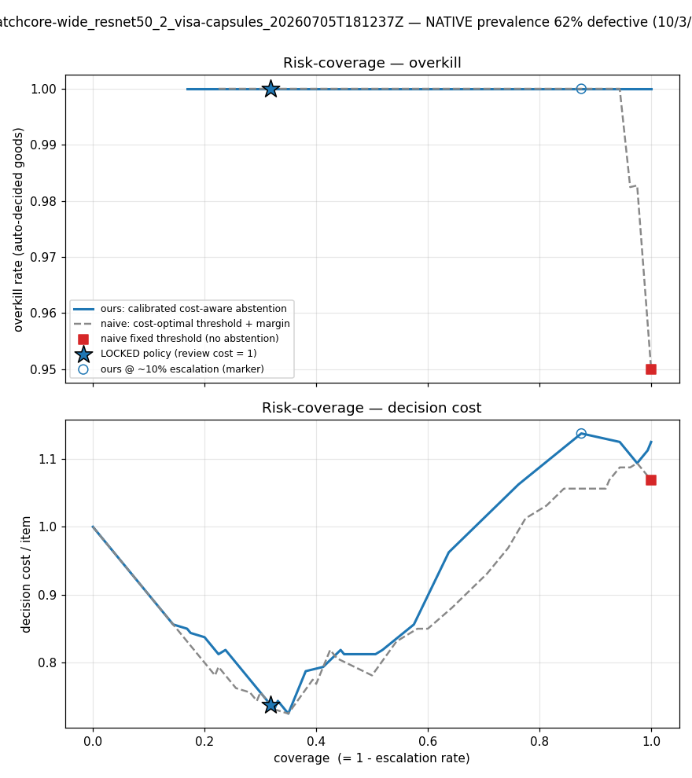

# Experiment log & evidence

Every claim below is backed by a committed artifact under `results/` (or an explicit
honest-null entry in [CLAUDE.md](../CLAUDE.md)). Mock/synthetic outputs are walled off
and never cited.

## 1. Phase 0 — detection baselines

| Detector | Ground | image-AUROC | Note |
|---|---|---|---|
| EfficientAD (600-step CPU) | MVTec `screw` | 0.559 | deliberately weak — the untrustworthy-detector case |
| PatchCore (GPU) | MVTec `screw` | 0.976 | saturated |
| PatchCore (GPU) | MVTec `capsule` | 0.976 | saturated |
| PatchCore (GPU) | VisA six-category sweep | 0.646–0.972 | see §3 |

## 2. Phase 1 — the operating envelope

The decision layer (cross Venn-Abers → locked cost matrix → PASS/FAIL/ESCALATE) is
compared against the **cost-optimal tuned threshold** on the same scores. Three measured
regimes:

| Regime | Ground | Outcome |
|---|---|---|
| Weak detector | EfficientAD screw (0.559) | **honest null** — guard refuses a false headline; no policy can help |
| Strong detector, expensive review | PatchCore screw (0.976) | abstention cuts overkill 0.29→0.16 and escapes→0, but review overhead loses on total cost — threshold suffices; break-even review cost reported |
| Genuine uncertainty | **VisA candle (0.972)** | **first real win: 11% (native) / 13% (realistic 100/3/1) cheaper than the tuned threshold** |

Per-run evidence: `results/runs/<id>/risk_coverage.png`, `risk_coverage_breakeven.png`,
`breakeven.csv`, `summary.md`. Example (VisA candle → capsules runs are committed):

## 3. Phase 2B Stage 2 — the substrate hunt (VisA sweep)

Standard MVTec saturates → the ESCALATE bucket empties → nothing to adjudicate. The gate
(pre-registered): ESCALATE∩good **and** n_dw ≥ ~30. VisA sweep (Kaggle GPU, PatchCore,
identical config/seed — candle numbers reproduced exactly across two hosts):

| category | image-AUROC | bucket | ESC∩good | n_dw | verdict |
|---|---|---|---|---|---|
| candle | 0.972 | 39 | 28 | 11 | direction-only |
| **capsules** | **0.739** | **109** | **57** | **54** | **powered — Stage-3 ground** |
| **macaroni1** | **0.815** | **138** | **83** | **45** | powered (conditional second ground) |
| macaroni2 | 0.646 | 174 | 92 | 80 | rejected — 87% escalation ≈ VLM-on-everything |
| pcb1 | 0.936 | 65 | 35 | 26 | borderline |
| pcb2 | 0.928 | 74 | 49 | 29 | borderline |

## 4. Phase 2B Stage 3 — two-arm full-vs-crop

**Design (locked before data):** same 109-item ESCALATE bucket, ARM-A full-image vs
ARM-B full+crop, K=5, arm-independent single-turn calls, pre-registered escape
classification (`src/aiqs/vlm/reasoning_rules.py`, frozen 2026-07-02), served-model stop,
checkpoint/resume.

**Dry-run #1 (voided, $5 lesson).** The crop never engaged: anomalib-2.x maps carry a
high normalization floor and the flat-map guard mislabeled 19/20 real maps as diffuse.
ARM-B ran byte-identical to ARM-A. Fixed against the real maps (quantile + geometric
bbox diffuse test → 19/20 crop), institutionalized as: *dry-run the instrument on real
exported maps before spending API budget.*

**Haiku rehearsal (complete — $1.77, 1090/1090 calls).** Run with
`--model claude-haiku-4-5` in a contamination-proof rehearsal namespace (the locked
headline model is claude-sonnet-4-6):

| Measure | ARM A (full) | ARM B (+crop) |
|---|---|---|
| verdicts | "clean" **545/545** | 535 clean · 5 defect · 5 unsure |
| escape rate (defectives) | 1.000 | 0.962 |
| tokens/call (in) | 809 | 1353 (+544 = the crop block) |

- Escape classification (250 eligible): **perception 5 (2%) · SEMANTIC 235 (94%) ·
  unclassified 10 (4% — labeling adequate)**.
- Escapes 100% stable-wrong (52/52) → K-run agreement is not an abstain signal.
- Confidence separation AUC 0.50 → self-reported confidence carries no signal.
- 5 parse failures handled by the loud fallback (marked, non-blocking) — the resilience
  layer worked in production.

**Rehearsal-grade conclusion:** a cheap-tier VLM second-look is a *rubber stamp* on
borderline industrial images, and its failures are **semantic, not perceptual** — it sees
the flagged region and calls it normal variation. Better pixels (the crop) do not fix a
semantic failure.

## 5. Next — the locked headline run

`claude-sonnet-4-6`, same ground, same frozen rules, ~$5, fully resume-safe. The
rehearsal sharpens the question it must answer: **are sonnet's escapes also
semantic-dominated?** If yes, the Phase-2B lever is prompt/anchor design, not image
fidelity — and that redirects the roadmap.
